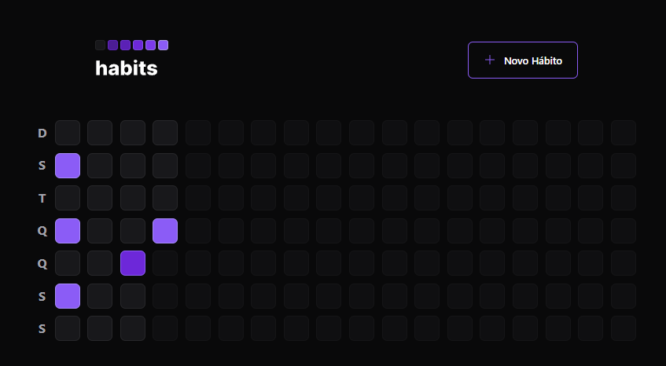
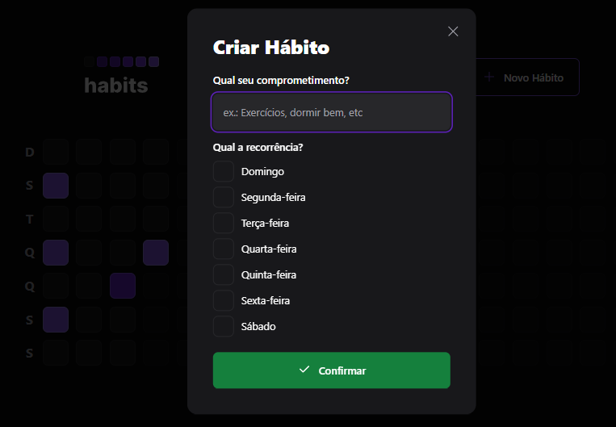
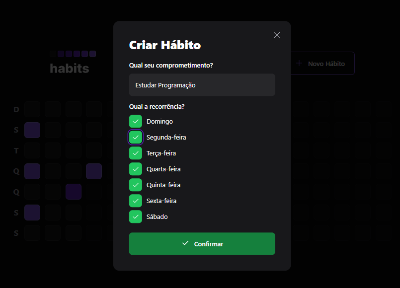
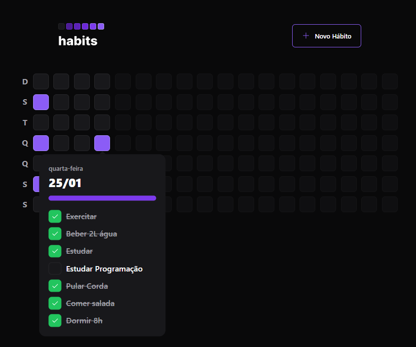

# Aplicativo Habits

Aplicativo criado durante o NLW da Rocketseat, com o intuito do usuário conseguir criar e monitorar seu hábitos!

## Conteúdo deste Readme:

- [Resumo](#resumo)
  - [O Desafio](#o-desafio)
  - [Screenshot](#screenshot)
- [Meu processo](#meu-processo)
  - [Projetado com](#projetado-com)
  - [O que eu aprendi](#o-que-eu-aprendi)
- [Autores](#autores)

## Resumo

### O Desafio

O aplicativo foi criado unindo o back-end (Prisma e SQLite), front-end (React e TypeScript) e mobile (ReactNative e TypeScript) visando proporcionar uma boa experiência para o usuário conseguir monitar seus hábitos durante a semana e poder acompanhar seu desempenho diário.

O usuário deverá conseguir:

- Criar novos hábito através do modal de criação;
- Escolher qual o título do hábito e em quais dias da semana ele deve ser cumprido;
- Navegar pelos dias do ano, acompanhando os hábitos criados e os concluídos;
- Acessar o popover de cada dia, contendo os hábitos daquele dia, bem como a barra de progresso dos hábitos concluídos;
- Não deverá conseguir alterar o desempenho em dias já passados, somente no dia atual;

### Screenshot

#### Imagem da parte inicial do app

#### Imagem do modal de criação de hábitos

#### Imagem do formulário preenchido

#### Imagem do popover com os hábitos concluídos no dia

## Processo de Criação

### Projetado com

- React;
- ReactNative;
- Prisma e SQLite (base de dados);
- TypeScript;
- Tailwindcss;
- Hooks useState, useEffect, useNavigate;
- dayjs para acessar datas com maior facilidade;
- Componentes Reutilizáveis;
- Raxis UI para componentes com acessibilidade;
- PhosphorReact para ícones;
- React Native Reanimated para animações

### O que eu aprendi

🟢 Integração do back-end com o front-end e mobile 
🟢 Como configurar e utilizar bases de dados 
🟢 Importação de componentes de bibiliotecas externas 
🟢 Estilização com o TailwindCSS 

## Autor

- [Matheus Trojan](https://www.linkedin.com/in/matheus-trojan/)
